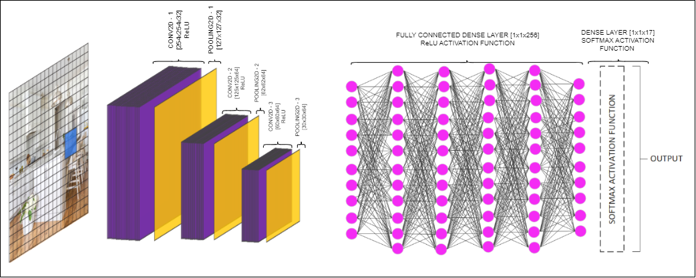

## House Design Image Classification Documentation

Welcome to the House Design Image Classification repository! This repository contains a series of Jupyter notebooks documenting the entire machine learning process for classifying various aspects of house design based on images. Each notebook covers a specific aspect of the classification pipeline, from data preprocessing to model evaluation. The project is divided into several categorization tasks, each focusing on a unique feature of house design.
 
### Table of Contents
+ Area Categorization
+ Style Categorization
+ Floor Design Categorization
+ Ceiling Design Categorization
+ Kitchen SubCategorical Design Categorization
+ Bathroom SubCategorical Design Categorization

### Area Categorization
> This module focuses on identifying the area of the house depicted in the image. It includes the classification of images into categories such as living room, kitchen, bathroom, bedroom, etc.
#### ML Model Architecture

### Style Categorization
> Once the area is identified, this module categorizes the style of the area. It uses the output from the Area Categorization model to classify the style of the space, such as modern, traditional, rustic, etc.

### Floor Design Categorization
This module classifies the floor design of the identified area. It focuses on various flooring types like hardwood, tile, carpet, etc., based on the area category provided by the Area Categorization model.

### Ceiling Design Categorization
This module is dedicated to identifying the ceiling design of the area classified by the Area Categorization model. It includes categorization of ceiling types such as vaulted, tray, coffered, etc.

### Kitchen SubCategorical Design Categorization
A specialized module for kitchen areas, this focuses on further subcategorization of kitchen designs. It includes identifying appliance finishes, cabinet designs, counter designs, and backsplash styles.

### Bathroom SubCategorical Design Categorization
Similar to the kitchen module, this focuses on detailed classification of bathroom design elements. It includes identifying vanity door designs, shower types and enclosures, wall tile types, and bathtub styles.

Each notebook is designed to be self-contained, with detailed explanations and code comments to guide you through the machine learning process for each classification task.

### Building of Decision Tree
The classification results generated by each ML model, after processing the images, are saved as JSON objects that include the image paths. These tagged attributes are later used to build a decision tree, helping to derive useful insights from the imagery data of real-estate listings.

For example, by analyzing the classification data, you might discover that modern kitchens with stainless steel appliances and marble countertops are more common in higher-priced listings. This insight can help real estate agents tailor their marketing strategies or advise homeowners on renovations to increase property value.
